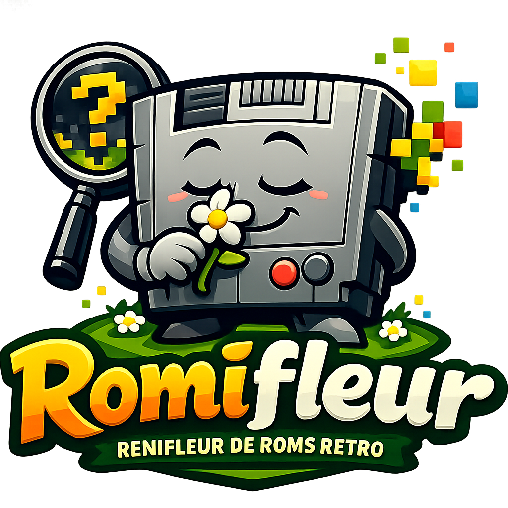
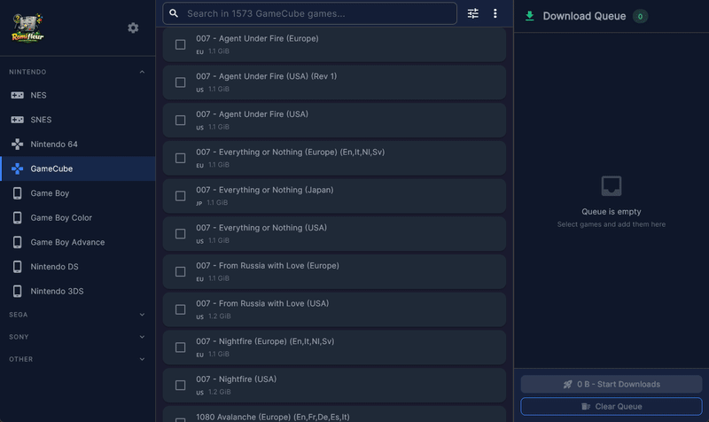

# Romifleur





**Romifleur** is a modern, cross-platform application designed to simplify the process of browsing, organizing, and downloading retro game ROMs. Now rewritten in **Flutter**, it offers a unified experience across **Windows, macOS, Linux, Android, and the Web (Docker)**.

> 📝 **See what's new in the [Changelog](CHANGELOG.md)!**

## 🚀 Features

*   **Multi-Platform**: Runs natively on all major desktop OSs and Android devices.
*   **Web/Docker Version**: Deploy a server-side instance that manages downloads directly to your server's filesystem.
*   **Modern UI**: A sleek, dark-themed interface built with Flutter, responsive from mobile to desktop.
*   **Advanced Filtering**: Filter games by region (Europe, USA, Japan, World) and language (En, Fr, De, Es, It, Ja).
*   **Rich Metadata**: Integrated with [**TheGamesDB**](https://thegamesdb.net/) to automatically fetch game covers, descriptions, and release dates.
*   **RetroAchievements Integration**: Connect your [RetroAchievements](https://retroachievements.org/) account to instantly see which games support achievements (🏆).
*   **Smart Queue**: Queue up multiple downloads from different consoles and let Romifleur handle them in the background.
*   **Auto-Extraction**: Automatically extracts `.zip` archives upon download.
*   **Privacy Focused**: Your API keys and settings are stored locally on your device.

---

## 🛠️ Installation & Usage

### 🖥️ Desktop (Windows, macOS, Linux)
1.  **Download** the latest release for your OS from the [Releases page](../../releases).
2.  **Extract**:
    *   **Windows/MacOS**: Extract the zip. You will find a clean `Romifleur/` folder.
    *   **Linux**: Download the `.AppImage` (recommended) or the `.tar.gz`.
3.  **Run**:
    *   **AppImage**: `chmod +x romifleur-linux-x86_64.AppImage` then `./romifleur...` (or double click).
    *   **Exe/App**: Run `Romifleur.exe` inside the folder.
4.  **First Run**:
    *   Select a destination folder for your ROMs (e.g., `Documents/ROMs`).
    *   (Optional) Enter your RetroAchievements Web API Key to enable achievement badges.
5.  **Enjoy**: Browse games by console, add them to your queue, and start downloading!

### 📱 Android
1.  **Download** the `.apk` file from the [Releases page](../../releases).
2.  **Install** it on your Android device.
3.  **Setup**: Grant storage permissions when prompted (includes 'Manage All Files' on Android 11+).

### 🐳 Docker (Web Version)
Run Romifleur as a web service on your home server (NAS, VPS, Raspberry Pi).

**docker-compose.yml**
```yaml
services:
  romifleur:
    image: ghcr.io/4sitam4/romifleur:latest
    container_name: romifleur-web
    ports:
      - "8080:8080"
    volumes:
      - ./path/to/your/roms:/app/data  # Where ROMs will be downloaded
    restart: unless-stopped
```

1.  Run `docker-compose up -d`.
2.  Open `http://localhost:8080`.
3.  **Note**: In this mode, downloads are saved **directly to the container/server volume** (`/app/data`), bypassing browser limitations.

**Or using pure Docker CLI:**
```bash
docker run -p 8080:8080 -v "/path/to/your/roms:/app/data" ghcr.io/4sitam4/romifleur:latest
```

---

## 🏗️ Building from Source

**Requirements:**
*   [Flutter SDK](https://flutter.dev/docs/get-started/install) (3.10+)
*   Dart 3.0+

**Clone & Setup:**
```bash
git clone https://github.com/4Sitam4/Romifleur.git
cd Romifleur/app
flutter pub get
```

**Build Commands:**
```bash
# Windows
flutter build windows --release

# Linux
flutter build linux --release

# macOS
flutter build macos --release

# Android
flutter build apk --release

# Web (Docker)
docker build -t romifleur .
```

---

## 📂 Folder Structure
Downloaded games are automatically organized by console:
```text
/Selected_Folder
  ├── n64/
  │   └── Super Mario 64.z64
  ├── snes/
  │   └── Super Metroid.sfc
  └── psx/
      └── Final Fantasy VII.iso
```

---

## 🤝 Acknowledgements
*   **TheGamesDB** for providing the extensive game metadata database.
*   **RetroAchievements** for their community-driven achievement platform.
